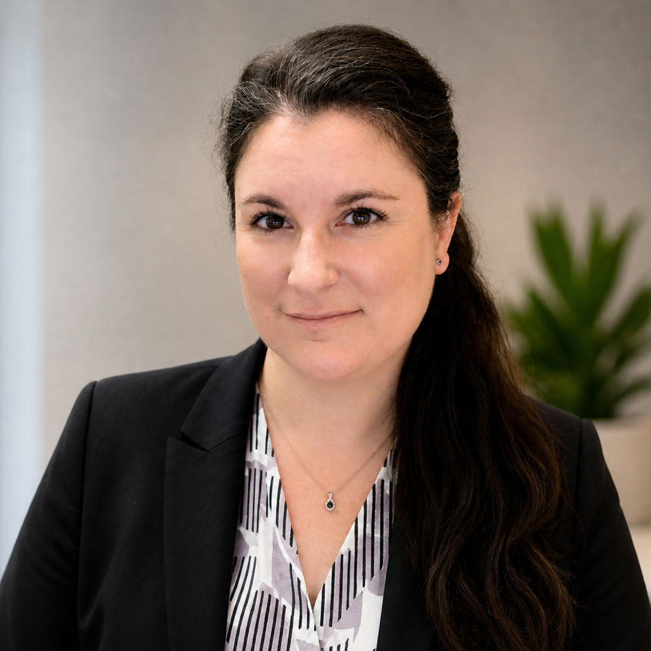
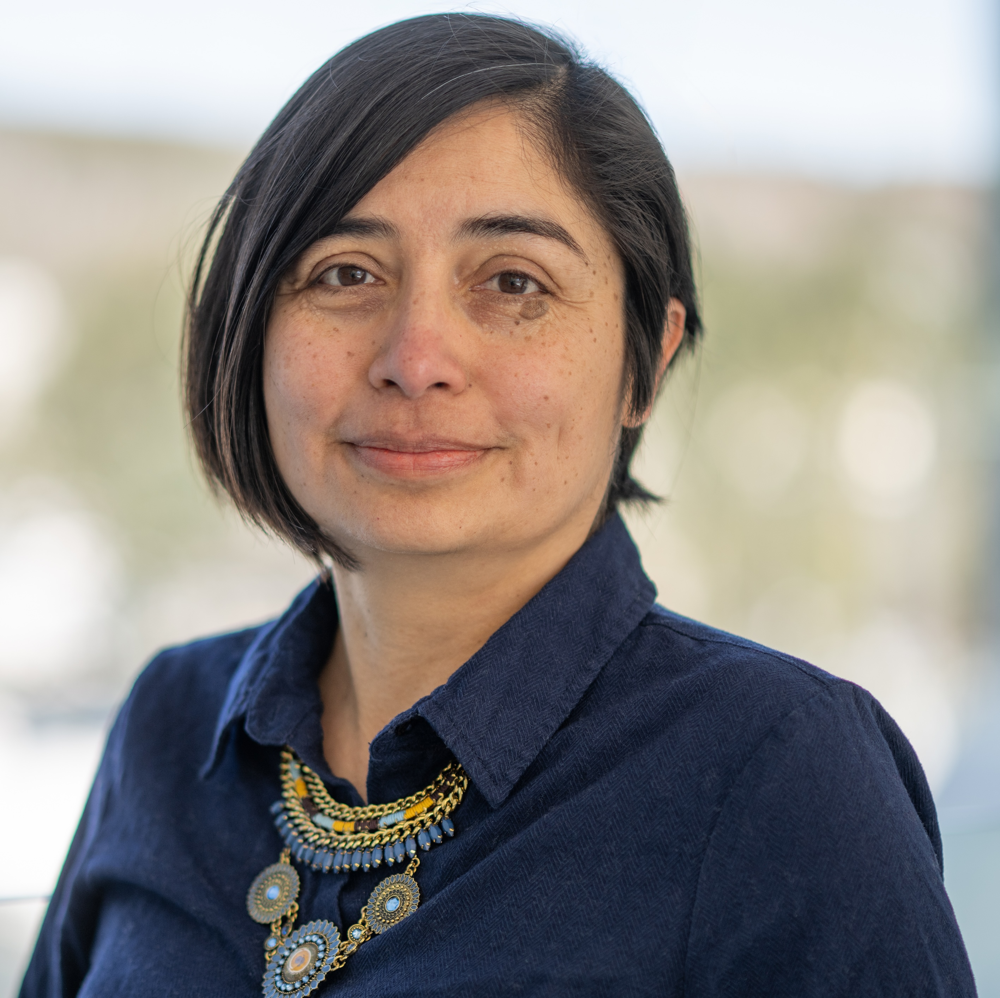
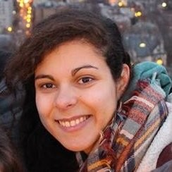
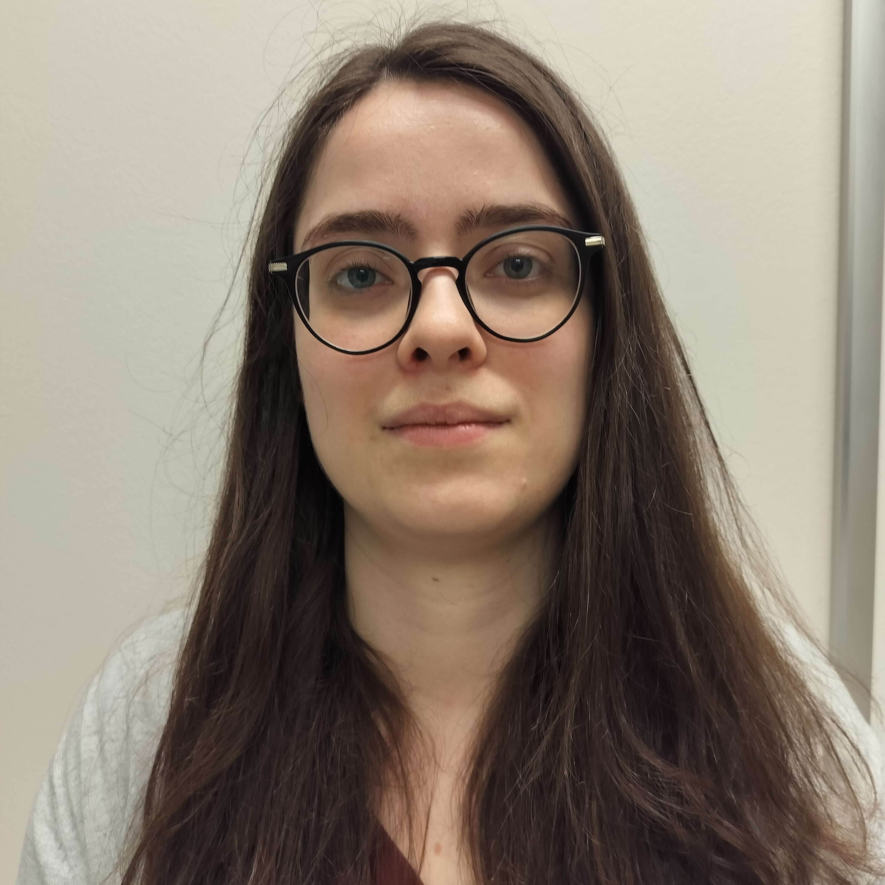
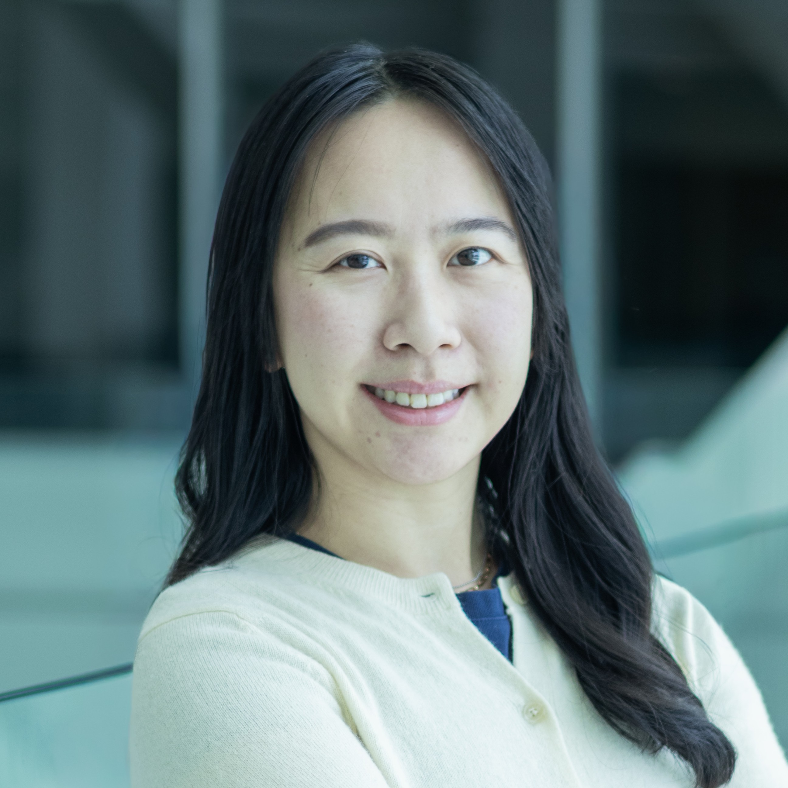
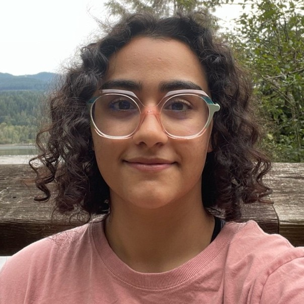
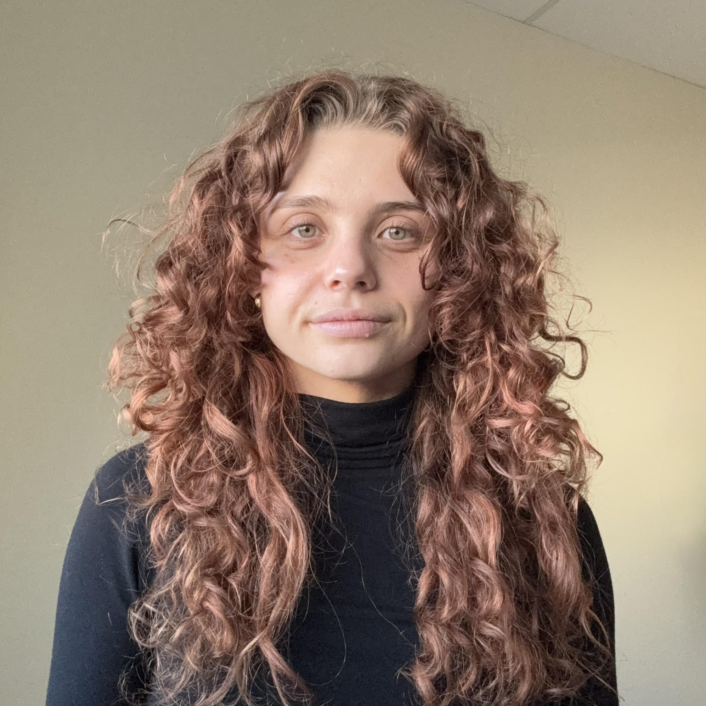
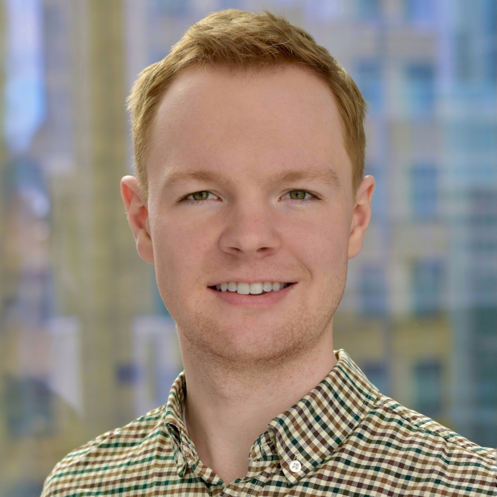
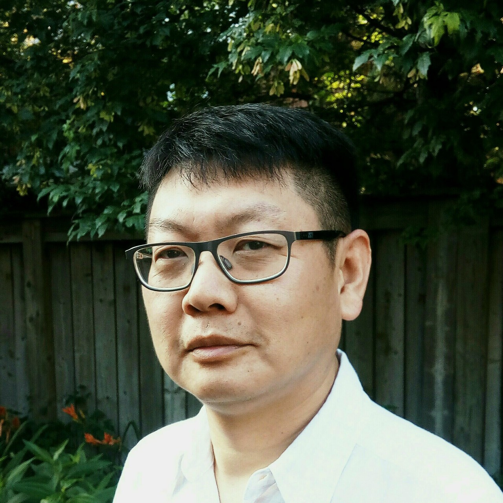

# Meet Your Faculty

## Instructors

#### Virginie Calderon (Montréal)

>
Head of the IRCM Bioinformatics Platform  
IRCM  
Montréal, Québec, Canada
>

Virginie Calderon is the Head of the IRCM Bioinformatics Platform in Montréal.
Dr. Virginie Calderon earned her PhD in Bioinformatics at the Université de Toulouse (France) and did her postdoctoral fellowship at the Université de Montréal and Sainte-Justine Research Center. She has been a Lecturer at UQAM for over 10 years and is strongly engaged in training, knowledge transfer, and the promotion of best practices in bioinformatics.
Her expertise focuses on Next‑Generation Sequencing data analysis to support research projects across the full analytical workflow, from experimental design and data quality assessment to downstream analysis and biological interpretation.

#### Lourdes Peña-Castillo (St John's) (she/her)

>
Professor, Departments of Biology and Computer Science 
Memorial University of Newfoundland 
St. John's, NL, Canada
>

Dr. Peña-Castillo is a Professor at the Departments of Biology and Computer Science (jointly appointed) at Memorial University Faculty of Science. Her current main area of research is the application of statistical- and machine learning-based methods to decipher bacterial gene regulation. Throughout her academic career, she has developed and/or applied artificial intelligence or machine learning methods in various areas such as biomedical sciences, games, and augmented virtuality.

## Teaching Assistants

#### Sophie Mockly (Montréal) (she/her)

>
Postdoctoral Fellow  
IRCM  
Montréal, QC, Canada
>

Sophie Mockly is a Postdoctoral Fellow at the Montreal Clinical Research Institute (IRCM), where her research focuses on non-coding RNAs using a combination of wet-lab and dry-lab approaches. She obtained her PhD in Molecular Biology from the University of Montpellier (France), developing expertise in transcriptome analysis, small RNA-seq, and sequence conservation analysis for miRNA target prediction. In late 2022, she started a Postdoctoral Fellowship at the IRCM, where she uses short-read and long-read sequencing to study the lncRNAs and their role in cancer.

#### Sophie Ehresmann (Montréal)

>
PhD Candidate  
IRCM, Université de Montréal  
Montréal, QC, Canada
>

Sophie Ehresmann is a PhD candidate at the Montreal Clinical Research Institute (IRCM) in the RNA and Noncoding Mechanisms of Disease Laboratory. She previously obtained a MSc in molecular biology at the Université de Montréal where she used omics tools to characterize pediatric neurodevelopmental disorders in patient-derived cell models. She now leverages both bioinformatics and molecular biology to study the development of breast cancer, with a focus on Nanopore sequencing technologies. 

#### Yvonne He (St John's) (she/her)

>
PhD Candidate  
Memorial University of Newfoundland  
St. John’s, NL, Canada
>

Yvonne He is a PhD candidate in the Department of Biology at Memorial University, where her research focuses on microbial genomics, specifically the evolution and applications of gene transfer agents. She is experienced in managing the entire genomic workflow, from the library prep to NGS data analyses. 

#### Paniz Taghipour (St John's) (she/her)

>
MSc Student  
Memorial University of Newfoundland  
St. John’s, NL, Canada
>

Paniz Taghipour is an MSc student in Bioinformatics at Memorial University of Newfoundland. Her research focuses on machine learning approaches for microbiome data analysis, including the evaluation of different data representations and classification methods for microbiome-based sample classification. 

## Facilitators

#### Canelle Schuhler-Husson (Montréal) 

>
Regional Coordinator, CBH Québec 
Canadian Bioinformatics Hub, Université de Montréal 
Montréal, Québec, Canada
>
> --- quebec@bioinformatics.ca

Canelle joined the Canadian Bioinformatics Hub team in 2025 as the Regional Coordinator for the province of Quebec. An engineer by training, she graduated in 2024 with a dual degree: a general engineering diploma from ECAM LaSalle in Lyon, France, and a master’s degree in Health Technology Engineering from the École de Technologie Supérieure (ÉTS) in Montreal. This multidisciplinary background has enabled her to develop expertise in health technologies, project management, and digital innovation applied to biomedical sciences.

Passionate about collaborative environments and committed to advancing life sciences and digital technologies, she now applies her skills in project management, communication, and logistics to the Canadian Bioinformatics Hub, with the goal of actively contributing to its regional and national reach.

#### Ben Fisher (St. John's) (he/him)

>
Regional Coordinator, CBH Atlantic 
Canadian Bioinformatics Hub, Dalhousie University 
Halifax, NS, Canada
>
> --- atlantic@bioinformatics.ca

Ben has a Master of Science degree in Microbiology and Immunology, completing his bioinformatics training under Dr. Morgan Langille at Dalhousie University. Throughout his training, he has instructed others in genetics, molecular biology, and microbiome data science. Ben is passionate about continued education of trainees and professionals, and firmly believes that enhancing bioinformatics and computational biology competencies will support the success of Canada’s current and future scientists.

## Systems Administrator

#### Zhibin Lu (he/him)

>
Senior Manager, Digital Research 
University Health Network 
Toronto, ON, Canada
>
> --- zhibin@gmail.com

Zhibin Lu is a senior manager at University Health Network Digital. He is responsible for UHN HPC operations and scientific software. He manages two HPC clusters at UHN, including system administration, user management, and maintenance of bioinformatics tools for HPC4health. He is also skilled in Next-Gen sequence data analysis and has developed and maintained bioinformatics pipelines at the Bioinformatics and HPC Core. He is a member of the Digital Research Alliance of Canada Bioinformatics National Team and Scheduling National Team.
