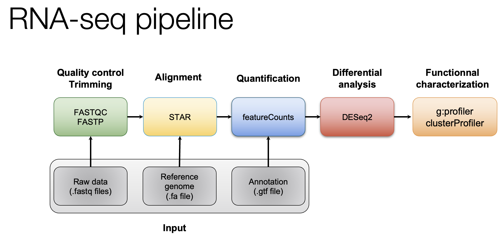

# Module 1: RNAseq inputs and QC

## Lecture

<iframe width="560" height="315" src="https://www.youtube.com/embed/USOMfsmnwhw?si=5TQYe8XHtWZ_vfCq" title="YouTube video player" frameborder="0" allow="accelerometer; autoplay; clipboard-write; encrypted-media; gyroscope; picture-in-picture; web-share" referrerpolicy="strict-origin-when-cross-origin" allowfullscreen></iframe>

<iframe src="https://docs.google.com/presentation/d/112p-Bx30at8G6N9tmTcbpKJY6Zhk1DH_/preview" width="640" height="480" allow="autoplay"></iframe> 


### Module 1 - Key concepts
* Review  sequencing, sequencing platforms, RNA sequencing, RNAseq study design, library construction strategies, sequencing depth, quality control, etc.

### Module 1 - Learning objectives

By the end of this module, you should be able to:

* explain what sequencing is
* mention different sequencing approaches and common sequencing platforms
* understand sequencing terminology
* explain what RNA-seq is and visually recognize RNA-seq data
* provide examples of study questions for which doing RNA-seq is appropriate
* recognize and describe fastq, fasta, and gtf file formats
* describe a general RNA-seq bioinformatics workflow
* interpret quality control (QC) of raw RNA-seq data using fastQC and multiqc
* use linux command-line
* get help outside of this course


<!-- ### FASTA/FASTQ/GTF mini lecture -->
<!-- If you would like a refresher on common file formats such as FASTA, FASTQ, and GTF files, we have made a [mini lecture](https://github.com/griffithlab/rnabio.org/blob/master/assets/lectures/cbw/2025/mini/RNASeq_MiniLecture_01_01_FASTA_FASTQ_GTF.pdf) briefly covering these. -->

## Module 1 - Practical Exercises

### Obtain a reference genome from Ensembl, iGenomes, NCBI or UCSC.

In this example analysis we will use the human GRCh38 version of the genome from Ensembl. Furthermore, we are actually going to perform the analysis using only a single chromosome (chr22) and the ERCC spike-in to make it run faster.

First we will create the necessary working directory.
```bash
cd $RNA_HOME
echo $RNA_REFS_DIR
mkdir -p $RNA_REFS_DIR

```
The complete data from which these files were obtained can be found at: [ftp://ftp.ensembl.org/pub/release-86/fasta/homo_sapiens/dna/](ftp://ftp.ensembl.org/pub/release-86/fasta/homo_sapiens/dna/). You could use wget to download the Homo_sapiens.GRCh38.dna_sm.primary_assembly.fa.gz file, then unzip/untar.

We have prepared a simplified reference for you. It contains chr22 (and ERCC transcript) fasta files in both a single combined file and individual files. Download the reference genome file to the rnaseq working directory

```bash
cd $RNA_REFS_DIR
wget http://genomedata.org/rnaseq-tutorial/fasta/GRCh38/chr22_with_ERCC92.fa
ls

```

View the first 10 lines of this file. Why does it look like this?
```bash
head chr22_with_ERCC92.fa

```

How many lines and characters are in this file? How long is this chromosome (in bases and Mbp)?
```bash
wc chr22_with_ERCC92.fa

```

View 10 lines from approximately the middle of this file. What is the significance of the upper and lower case characters?
```bash
head -n 425000 chr22_with_ERCC92.fa | tail

```

How many sequences are in this fasta file?

```bash
grep ">" chr22_with_ERCC92.fa | wc -l

```

View a list of all the sequences in our reference genome fasta file.

```bash
grep ">" chr22_with_ERCC92.fa

```

What is the count of each base in the entire reference genome file (skipping the header lines for each sequence)?

```bash
cat chr22_with_ERCC92.fa | grep -v ">" | perl -ne 'chomp $_; $bases{$_}++ for split //; if (eof){print "$_ $bases{$_}\n" for sort keys %bases}'

```

Note: Instead of the above, you might consider getting reference genomes and associated annotations from [UCSC. e.g., UCSC GRCh38 download](http://hgdownload.cse.ucsc.edu/goldenPath/hg38/chromosomes/).

Wherever you get them from, remember that the names of your reference sequences (chromosomes) must those matched in your annotation gtf files (described in the next section).


***

### Note on complex commands and scripting in Unix
Take a closer look at the command above that counts the occurrence of each nucleotide base in our chr22 reference sequence. Note that for even a seemingly simple question, commands can become quite complex. In that approach, a combination of Unix commands, pipes, and the scripting language Perl are used to answer the question. In bioinformatics, generally this kind of scripting comes up before too long, because you have an analysis question that is so specific there is no out of the box tool available. Or an existing tool will give perform a much more complex and involved analysis than needed to answer a very focused question.

In Unix there are usually many ways to solve the same problem. Perl as a language has mostly fallen out of favor. This kind of simple text parsing problem is one area it perhaps still remains relevant. Let's benchmark the run time of the previous approach and constrast with several alternatives that do not rely on Perl.

Each of the following gives exactly the same answer. `time` is used to measure the run time of each alternative. Each starts by using `cat` to dump the file to standard out and then using `grep` to remove the header lines starting with ">". Each ends with `column -t` to make the output line up consistently.

If you want to see more info about a command, for example `fold`, you can type `man fold`

```
#1. The Perl approach. This command removes the end of line character with chomp, then it splits each line into an array of individual characters, amd it creates a data structure called a hash to store counts of each letter on each line. Once the end of the file is reached it prints out the contents of this data structure in order.  
time cat chr22_with_ERCC92.fa | grep -v ">" | perl -ne 'chomp $_; $bases{$_}++ for split //; if (eof){print "$bases{$_} $_\n" for sort keys %bases}' | column -t

#2. The Awk approach. Awk is an alternative scripting language include in most linux distributions. This command is conceptually very similar to the Perl approach but with a different syntax. A for loop is used to iterate over each character until the end ("NF") is reached. Again the counts for each letter are stored in a simple data structure and once the end of the file is reach the results are printed.  
time cat chr22_with_ERCC92.fa | grep -v ">" | awk '{for (i=1; i<=NF; i++){a[$i]++}}END{for (i in a){print a[i], i}}' FS= - | sort -k 2 | column -t

#3. The Sed approach. Sed is another alternative scripting language. "tr" is used to remove newline characters. Then sed is used simply to split each character onto its own line, effectively creating a file with millions of lines. Then unix sort and uniq are used to produce counts of each unique character, and sort is used to order the results consistently with the previous approaches.
time cat chr22_with_ERCC92.fa | grep -v ">" | tr -d '\n' | sed 's/\(.\)/\1\n/g'  - | sort | uniq -c | sort -k 2 | column -t

#4. The grep appoach. The "-o" option of grep splits each match onto a line which we then use to get a count. The "-i" option makes the matching work for upper/lower case. The "-P" option allows us to use Perl style regular expressions with Greg.
time cat chr22_with_ERCC92.fa | grep -v ">" | grep -i -o -P "a|c|g|t|y|n" | sort | uniq -c

#5. Finally, the simplest/shortest approach that leverages the unix fold command to split each character onto its own line as in the Sed example.
time cat chr22_with_ERCC92.fa | grep -v ">" | fold -w1 | sort | uniq -c | column -t


```
Which method is fastest? Why are the first two approaches so much faster than the others?

***

### PRACTICAL EXERCISE 2 (ADVANCED)
Assignment: Use a command-line scripting approach of your choice to further examine our chr22 reference genome file and answer the following questions.

Questions:
- How many bases on chromosome 22 correspond to repetitive elements?
- What is the percentage of the whole length?
- How many occurences of the EcoRI (GAATTC) restriction site are present in the chromosome 22 sequence?

Hint: Each question can be tackled using approaches similar to those above, using the file 'chr22_with_ERCC92.fa' as a starting point.
Hint: To make things simpler, first produce a file with only the chr22 sequence.
Hint: Remember that repetitive elements in the sequence are represented in lower case

Solution: When you are ready you can check your approach against the [Solutions](https://rnabio.org/module-09-appendix/0009/05/01/Practical_Exercise_Solutions/#practical-exercise-2---reference-genomes).


### Obtain Known Gene/Transcript Annotations

In this tutorial we will use annotations obtained from Ensembl ([Homo_sapiens.GRCh38.86.gtf.gz](ftp://ftp.ensembl.org/pub/release-86/gtf/homo_sapiens/Homo_sapiens.GRCh38.86.gtf.gz)) for chromosome 22 only. For time reasons, these are prepared for you and made available on your AWS instance. But you should get familiar with sources of gene annotations for RNA-seq analysis.

Copy the gene annotation files to the working directory.

```bash
echo $RNA_REFS_DIR
cd $RNA_REFS_DIR
wget http://genomedata.org/rnaseq-tutorial/annotations/GRCh38/chr22_with_ERCC92.gtf

```

Take a look at the contents of the .gtf file. Press `q` to exit the `less` display.

```bash
echo $RNA_REF_GTF
less -p start_codon -S $RNA_REF_GTF

```

Note how the `-S` option makes it easier to view this file with `less`. Make the formatting a bit nicer still:
```bash
cat chr22_with_ERCC92.gtf | column -t | less -p exon -S
```

How many unique gene IDs are in the .gtf file?

We can use a perl command-line command to find out:

```bash
perl -ne 'if ($_ =~ /(gene_id\s\"ENSG\w+\")/){print "$1\n"}' $RNA_REF_GTF | sort | uniq | wc -l

```

* Using `perl -ne ''` will execute the code between single quotes, on the .gtf file, line-by-line.

* The `$_` variable holds the contents of each line.

* The `'if ($_ =~//)'` is a pattern-matching command which will look for the pattern "gene_id" followed by a space followed by "ENSG" and one or more word characters (indicated by `\w+`) surrounded by double quotes.

* The pattern to be matched is enclosed in parentheses. This allows us to print it out from the special variable `$1`.

* The output of this perl command will be a long list of ENSG Ids.

* By piping to `sort`, then `uniq`, then word count we can count the unique number of genes in the file.

We can also use `grep` to find this same information.

```bash
cat chr22_with_ERCC92.gtf | grep -w gene | wc -l

```

* `grep -w gene` is telling grep to do an exact match for the string 'gene'. This means that it will return lines that are of the feature type `gene`.

Write a command to find out how many start codons are in the .gtf file. Hint: start codons have as feature type `start_codon`.


Now view the structure of a single transcript in GTF format. Press `q` to exit the `less` display when you are done.

```bash
grep ENST00000342247 $RNA_REF_GTF | less -p "exon\s" -S

```

To learn more, see:

* [http://perldoc.perl.org/perlre.html#Regular-Expressions](http://perldoc.perl.org/perlre.html#Regular-Expressions)
* [http://www.perl.com/pub/2004/08/09/commandline.html](http://www.perl.com/pub/2004/08/09/commandline.html)

### Definitions:
**Reference genome** - The nucleotide sequence of the chromosomes of a species. Genes are the functional units of a reference genome and gene annotations describe the structure of transcripts expressed from those gene loci.

**Gene annotations** - Descriptions of gene/transcript models for a genome. A transcript model consists of the coordinates of the exons of a transcript on a reference genome. Additional information such as the strand the transcript is generated from, gene name, coding portion of the transcript, alternate transcript start sites, and other information may be provided.

**GTF (.gtf) file** - A common file format referred to as Gene Transfer Format used to store gene and transcript annotation information. You can learn more about this format here: [http://genome.ucsc.edu/FAQ/FAQformat#format4](http://genome.ucsc.edu/FAQ/FAQformat#format4)

### The Purpose of Gene Annotations (.gtf file)
Gene/transcript annotations are used for several purposes:

* During indexing, annotations may be provided to some tools create local indexes to represent transcripts as well as a global index for the entire reference genome. This allows for faster mapping and better mapping across exon boundaries and splice sites. If an alignment still can not be found it will attempt to determine if the read corresponds to a novel exon-exon junction.

* During quantification, annotations are used to determine which reads are mapped to which features (genes).

### Sources for obtaining gene annotation files
There are many possible sources of .gtf gene/transcript annotation files. For example, from Ensembl, UCSC, RefSeq, etc. Several options and related instructions for obtaining the gene annotation files are provided below.

#### I. ENSEMBL FTP SITE

Based on Ensembl annotations only. Available for many species. [http://useast.ensembl.org/info/data/ftp/index.html](http://useast.ensembl.org/info/data/ftp/index.html)

#### II. UCSC TABLE BROWSER

Based on UCSC annotations or several other possible annotation sources collected by UCSC. You might chose this option if you want to have a lot of flexibility in the annotations you obtain. e.g. to grab only the transcripts from chromosome 22 as in the following example:

* Open the following in your browser: [http://genome.ucsc.edu/](http://genome.ucsc.edu/)
* Select 'Tools' and then 'Table Browser' at the top of the page.
* To select the dataset, select 'Human - Dec. 2013 (GRCh38/hg38) (hg38)' from the drop down menu under Genome.
* Select 'Genes and Gene Predictions' and 'GENCODE v49' for Group and Track from the corresponding drop down menus. To limit your selection to only chromosome 22, select the 'position' option beside 'region', enter 'chr22' in the 'position' box.
* Select 'GTF - gene transfer format' for output format and enter 'UCSC_Genes.gtf' for output filename.
* Hit the 'get output' button and save the file. 

Take a look at the .gtf file downloaded.

In addition to the .gtf file you may find uses for some extra files providing alternatively formatted or additional information on the same transcripts. For example:

##### How to get a Gene bed file:

* Change the output format to 'BED - browser extensible data'.
* Change the output filename to 'UCSC_Genes.bed', and hit the 'get output' button.
* On the new page, make sure 'Whole Gene' is selected, hit the 'get BED' button, and save the file.

Take a look at the .bed file downloaded. What are the columns of the bed file?

Compare the start and end coordinates of the gene `ENST00000724296.1` given in the .gtf file with those given in the .bed file. Do you notice any discrepancy? Read [this info about the BED format](https://switzerlandomics.ch/learn/bed-format/). Can you explain the difference in the start coordinate between the .gtf and the .bed file?


##### How to get an Exon bed file:

* Go back one page in your browser and change the output file to 'UCSC_Exons.bed', then hit the 'get output' button again.
* Select 'Exons plus', enter 0 in the adjacent box, hit the 'get BED' button, and save the file.

##### How to get gene symbols and descriptions for all UCSC genes:

* Again go back one page in your browser and change the 'output format' to 'selected fields from primary and related tables'.
* Change the output file to 'UCSC_Names.txt', and hit the 'get output' button.
* Make sure 'chrom' is selected under `Select Fields from`.
* Under 'Linked Tables' make sure 'kgXref' is selected, and then hit 'Allow Selection From Checked Tables'. This will link the table and give you access to its fields.
* Under 'hg38.kgXref fields' select: 'kgID', 'geneSymbol', 'description'.
* Hit the 'get output' button and save the file.
* Look at the downloaded file. Can you explain what mapping is in this file?
* To get annotations for the whole genome, make sure 'genome' is selected beside 'region' in the Table Browser page. To download compressed files, select `Gzip compressed` for `File type returned`. To decompress, use 'gunzip filename' in linux.


### Important notes:
**On chromosome naming conventions:**
In order for your RNA-seq analysis to work, the chromosome names in your .gtf file must match those in your reference genome (i.e. your reference genome fasta file). If you get a result where all transcripts have an expression value of 0, you may have overlooked this. Unfortunately, Ensembl, NCBI, and UCSC can not agree on how to name the chromosomes in many species, so this problem may come up often. You can avoid this by getting a complete reference genome and gene annotation package from the same source (e.g., Ensembl) to maintain consistency.

**On reference genome builds:**
Your annotations must correspond to the same reference genome build as your reference genome fasta file. e.g., both correspond to UCSC human build 'hg38', NCBI human build 'GRCh38', etc. Even if both your reference genome and annotations are from UCSC or Ensembl they could still correspond to different versions of that genome. This would cause problems in any RNA-seq pipeline.

A more detailed discussion of commonly used version of the human reference genome can be found in a companion workshop [PMBIO Reference Genomes](https://pmbio.org/module-02-inputs/0002/02/01/Reference_Genome/).

### Dataset


We will be using the dataset `GSE47774` go to [NCBI GEO](https://www.ncbi.nlm.nih.gov/geo/) and search for this accession number. 

What sequencing platform was used? Are the data single-end or paired-end? How many replicates?

For this exercise, we use a subset of the data (**first 1,000,000 reads per pair**).

Get the data.

```bash
echo $RNA_DATA_DIR
mkdir -p $RNA_DATA_DIR
cd $RNA_DATA_DIR
wget http://genomedata.org/rnaseq-tutorial/HBR_UHR_ERCC_ds_5pc.tar
```

Unpack the tar file

```bash
tar -xvf HBR_UHR_ERCC_ds_5pc.tar
ls
```


### Pipeline



### Quality control

The first step in every RNA-seq pipeline must be checking the quality of the raw data.

Go to the directory with the data

```bash
echo $RNA_DATA_DIR
cd $RNA_DATA_DIR
```

Create FastQC reports for all the files and save the reports in the directory `$RNA_HOME/qc/raw_fastqc/`. The output directory has to be created before hand.

```bash
mkdir -p $RNA_HOME/qc/raw_fastqc/
fastqc *.fastq.gz -o $RNA_HOME/qc/raw_fastqc/
```

Go to the directory with the FASTQC reports and create a multiqc report

```bash
cd $RNA_HOME/qc/raw_fastqc/
multiqc .
```

The resulting html reports can be viewed by navigating to the following address:
(If you are not using the UHN cluster, your address will be different)

* http://**##.uhn-hpc.ca**/rnaseq/qc/raw_fastqc


Look at one FASTQC report and at the multiqc report. What's the read length? How is the quality of the data?

### Read trimming with Fastp

Use Fastp to trim sequence adapter from the read FASTQ files and also perform basic data quality cleanup. The output of this step will be trimmed and filtered FASTQ files for each data set.

Refer to the Fastp project and manual for a more detailed explanation:

* [fastp](https://github.com/OpenGene/fastp)

Fastp basic usage:
```bash
    fastp -i in.R1.fq.gz -I in.R2.fq.gz -o out.R1.fq.gz -O out.R2.fq.gz
```
The `-i` and `-I` parameters specify input R1 and R2 data files (raw data)
The `-o` and `-O` parameters specify output R1 and R2 data files (trimmed and quality filtered) 
Extra options specified below:

* '-l 25' the minimum read length allowed after trimming is 25bp
* '--adapter_fasta' the path to the adapter FASTA file containing adapter sequences to trim
* '--trim_front1 13' trim a fixed number (13 in this case) of bases off the left end of read1
* '--trim_front2 13' trim a fixed number (13 in this case) of bases off the left end of read2
* '--json' the path to store a log file in JSON file format 
* '--html' the path to store a web report file
* '2>' use to store the information that would be printed to the screen into a file instead

First, set up some directories for output

```bash
echo $RNA_DATA_TRIM_DIR
mkdir -p $RNA_DATA_TRIM_DIR
```

Download necessary Illumina adapter sequence files.

```bash
cd $RNA_REFS_DIR
wget http://genomedata.org/rnaseq-tutorial/illumina_multiplex.fa
```

Use fastp to remove illumina adapter sequences (if any), trim the first 13 bases of each read, and perform default read quality filtering to remove reads that are too short, have too many low quality bases or have too many N's.

```bash
cd $RNA_HOME

export S1=UHR_Rep1_ERCC-Mix1_Build37-ErccTranscripts-chr22
fastp -i $RNA_DATA_DIR/$S1.read1.fastq.gz -I $RNA_DATA_DIR/$S1.read2.fastq.gz -o $RNA_DATA_TRIM_DIR/$S1.read1.fastq.gz -O $RNA_DATA_TRIM_DIR/$S1.read2.fastq.gz -l 25 --adapter_fasta $RNA_REFS_DIR/illumina_multiplex.fa --trim_front1 13 --trim_front2 13 --json $RNA_DATA_TRIM_DIR/$S1.fastp.json --html $RNA_DATA_TRIM_DIR/$S1.fastp.html 2>$RNA_DATA_TRIM_DIR/$S1.fastp.log

export S2=UHR_Rep2_ERCC-Mix1_Build37-ErccTranscripts-chr22
fastp -i $RNA_DATA_DIR/$S2.read1.fastq.gz -I $RNA_DATA_DIR/$S2.read2.fastq.gz -o $RNA_DATA_TRIM_DIR/$S2.read1.fastq.gz -O $RNA_DATA_TRIM_DIR/$S2.read2.fastq.gz -l 25 --adapter_fasta $RNA_REFS_DIR/illumina_multiplex.fa --trim_front1 13 --trim_front2 13 --json $RNA_DATA_TRIM_DIR/$S2.fastp.json --html $RNA_DATA_TRIM_DIR/$S2.fastp.html 2>$RNA_DATA_TRIM_DIR/$S2.fastp.log

export S3=UHR_Rep3_ERCC-Mix1_Build37-ErccTranscripts-chr22
fastp -i $RNA_DATA_DIR/$S3.read1.fastq.gz -I $RNA_DATA_DIR/$S3.read2.fastq.gz -o $RNA_DATA_TRIM_DIR/$S3.read1.fastq.gz -O $RNA_DATA_TRIM_DIR/$S3.read2.fastq.gz -l 25 --adapter_fasta $RNA_REFS_DIR/illumina_multiplex.fa --trim_front1 13 --trim_front2 13 --json $RNA_DATA_TRIM_DIR/$S3.fastp.json --html $RNA_DATA_TRIM_DIR/$S3.fastp.html 2>$RNA_DATA_TRIM_DIR/$S3.fastp.log

export S4=HBR_Rep1_ERCC-Mix2_Build37-ErccTranscripts-chr22
fastp -i $RNA_DATA_DIR/$S4.read1.fastq.gz -I $RNA_DATA_DIR/$S4.read2.fastq.gz -o $RNA_DATA_TRIM_DIR/$S4.read1.fastq.gz -O $RNA_DATA_TRIM_DIR/$S4.read2.fastq.gz -l 25 --adapter_fasta $RNA_REFS_DIR/illumina_multiplex.fa --trim_front1 13 --trim_front2 13 --json $RNA_DATA_TRIM_DIR/$S4.fastp.json --html $RNA_DATA_TRIM_DIR/$S4.fastp.html 2>$RNA_DATA_TRIM_DIR/$S4.fastp.log

export S5=HBR_Rep2_ERCC-Mix2_Build37-ErccTranscripts-chr22
fastp -i $RNA_DATA_DIR/$S5.read1.fastq.gz -I $RNA_DATA_DIR/$S5.read2.fastq.gz -o $RNA_DATA_TRIM_DIR/$S5.read1.fastq.gz -O $RNA_DATA_TRIM_DIR/$S5.read2.fastq.gz -l 25 --adapter_fasta $RNA_REFS_DIR/illumina_multiplex.fa --trim_front1 13 --trim_front2 13 --json $RNA_DATA_TRIM_DIR/$S5.fastp.json --html $RNA_DATA_TRIM_DIR/$S5.fastp.html 2>$RNA_DATA_TRIM_DIR/$S5.fastp.log

export S6=HBR_Rep3_ERCC-Mix2_Build37-ErccTranscripts-chr22
fastp -i $RNA_DATA_DIR/$S6.read1.fastq.gz -I $RNA_DATA_DIR/$S6.read2.fastq.gz -o $RNA_DATA_TRIM_DIR/$S6.read1.fastq.gz -O $RNA_DATA_TRIM_DIR/$S6.read2.fastq.gz -l 25 --adapter_fasta $RNA_REFS_DIR/illumina_multiplex.fa --trim_front1 13 --trim_front2 13 --json $RNA_DATA_TRIM_DIR/$S6.fastp.json --html $RNA_DATA_TRIM_DIR/$S6.fastp.html 2>$RNA_DATA_TRIM_DIR/$S6.fastp.log

```

### Use FastQC and multiqc to compare the impact of trimming

Optional exercise: Generate FastQC and multiqc reports for fastq files after trimming. Compare these reports with those generated before trimming.


#### Acknowledgments
Some exercises adapted from Malachi Griffith, Jason R. Walker, Nicholas C. Spies, Benjamin J. Ainscough, Obi L. Griffith*. 2015. [Informatics for RNA-seq: A web resource for analysis on the cloud.](http://dx.doi.org/10.1371/journal.pcbi.1004393) PLoS Comp Biol. 11(8):e1004393.


