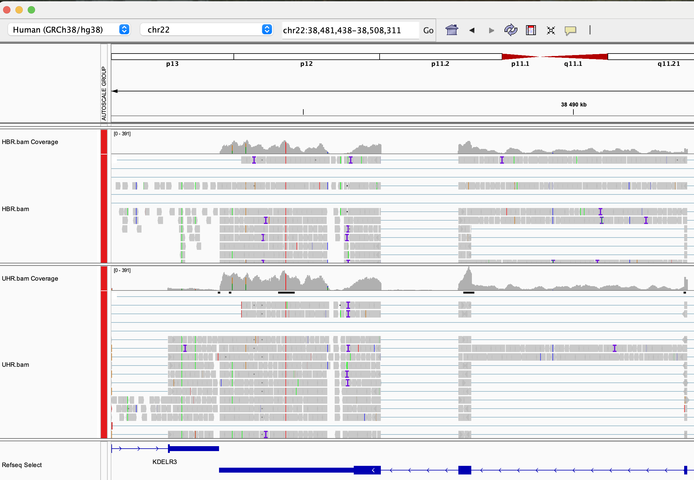

# Module 2: RNA-seq alignment concepts and file formats


## Lecture

<iframe src="https://docs.google.com/presentation/d/1Wf2LYn5fYTqdT1szFpkyDHmPZ8W0b5jq/preview" width="640" height="480" allow="autoplay"></iframe>  


## Module 2 - Key concepts
* Splice-aware alignment, SAM/BAM format

## Module 2 - Learning objectives
* RNA-seq alignment challenges and common questions
* Alignment strategies
* STAR
* Introduction to the BAM and BED formats
* Basic manipulation of BAMs
* Visualization of RNA-seq alignments in IGV
* Alignment QC Assessment
* Pseudo-alignment


## Lectures from previous workshop
* [Introduction to alignment mini lecture](https://github.com/griffithlab/rnabio.org/blob/master/assets/lectures/cbw/2025/mini/RNASeq_MiniLecture_02_01_Alignment.pdf)
* [Alignment/Assembly/kmer mini lecture](https://github.com/griffithlab/rnabio.org/blob/master/assets/lectures/cbw/2025/mini/RNASeq_MiniLecture_02_02_Alignment_vs_Assembly_vs_Kmer.pdf)
* [SAM/BAM/BED formats mini lecture](https://github.com/griffithlab/rnabio.org/blob/master/assets/lectures/cbw/2025/mini/RNASeq_MiniLecture_02_03_SAM_BAM_BED.pdf)
* [Introduction to IGV lecture](https://github.com/griffithlab/rnabio.org/blob/master/assets/lectures/cbw/2025/full/RNASeq_Module2_IGV_Tutorial_Brief.pdf)
* [Alignment QC mini lecture](https://github.com/griffithlab/rnabio.org/blob/master/assets/lectures/cbw/2025/mini/RNASeq_MiniLecture_02_04_alignmentQC.pdf)

## Module 2 - Practical Exercises

### STAR alignment

**Prepare genome for alignment**

If not done previously, prepare the genome for PE150:

```bash
cd $RNA_REFS_DIR
STAR --runMode genomeGenerate \
     --genomeDir ./star_index \
     --genomeFastaFiles chr22_with_ERCC92.fa \
     --sjdbGTFfile chr22_with_ERCC92.gtf \
     --sjdbOverhang 149
```

**STAR Alignment**

Perform alignments with STAR to the genome.

First, begin by making the appropriate output directory for our alignment results.

```bash
echo $RNA_ALIGN_DIR
mkdir -p $RNA_ALIGN_DIR
cd $RNA_ALIGN_DIR
```
The output of this step will be a BAM file for each sample.

Export samples name in environment variable to make a loop:

```bash
SAMPLES=(
UHR_Rep1_ERCC-Mix1_Build37-ErccTranscripts-chr22
UHR_Rep2_ERCC-Mix1_Build37-ErccTranscripts-chr22
UHR_Rep3_ERCC-Mix1_Build37-ErccTranscripts-chr22
HBR_Rep1_ERCC-Mix2_Build37-ErccTranscripts-chr22
HBR_Rep2_ERCC-Mix2_Build37-ErccTranscripts-chr22
HBR_Rep3_ERCC-Mix2_Build37-ErccTranscripts-chr22
)
```

Loop for the mapping:

```bash
for S in ${SAMPLES[@]}
do
  echo "Aligning $S"

  STAR \
    --runThreadN 8 \
    --genomeDir $STAR_INDEX \
    --readFilesIn \
      $RNA_DATA_TRIM_DIR/${S}.read1.fastq.gz \
      $RNA_DATA_TRIM_DIR/${S}.read2.fastq.gz \
    --readFilesCommand zcat \
    --outFileNamePrefix $RNA_ALIGN_DIR/${S}. \
    --outSAMtype BAM SortedByCoordinate \
	> $RNA_ALIGN_DIR/${S}.STAR.log 2>&1
done
```

**Argument description**

- `--runThreadN 8`  
  Number of threads used for alignment (speeds up computation).

- `--genomeDir $STAR_INDEX`  
  Path to the STAR genome index directory.

- `--readFilesIn`  
  Input files (paired-end reads: read1 and read2).

- `$RNA_DATA_TRIM_DIR/${S}.read1.fastq.gz`  
  Forward reads after trimming.

- `$RNA_DATA_TRIM_DIR/${S}.read2.fastq.gz`  
  Reverse reads after trimming.

- `--readFilesCommand zcat`  
  Uncompress gzipped FASTQ files on-the-fly.

- `--outFileNamePrefix $RNA_ALIGN_DIR/${S}.`  
  Prefix for all output files generated by STAR.

- `--outSAMtype BAM SortedByCoordinate`  
  Output alignment file in BAM format, sorted by genomic coordinates.

- `> $RNA_ALIGN_DIR/${S}.STAR.log 2>&1`  
  Redirect standard output and error messages to a log file for each sample.


Refer to STAR manual for a more detailed explanation:

* [STARmanual.pdf](https://github.com/alexdobin/STAR/blob/master/doc/STARmanual.pdf)

The basic options to run a mapping job are as follows:


**Question 1**

Why is RNA-seq alignment more complex than DNA-seq alignment?

- What is the role of splice-aware aligners like STAR?
- What biological phenomenon makes alignment more challenging?


**Question 2**

What information is stored in a BAM file?

- Can you identify where to find:
  - mapping position
  - mapping quality
  - CIGAR string
- Why is BAM preferred over SAM?


### Post-alignment QC

STAR generates a summary of the alignments in a .log file for each sample. 
Notice the number of total reads, reads aligned and various metrics regarding how the reads aligned to the reference.
To help alignment QC, multiQC can be used to aggregate the alignemnt statistics.

Run the following command at the root of your project, so multiqc can screen for fastQC, fastp and star statistics.

```bash
multiqc ./
```

Go through the generated html by browsing through the following directory in a web browser:

http://YOUR_PUBLIC_IPv4_ADDRESS/workspace/rnaseq


**Question 3**
What percentage of reads successfully aligned to the reference genome?

- Is this alignment rate acceptable?
- What could explain a low alignment rate?


**Question 4**
How many reads are uniquely mapped vs multi-mapped?

- Why are multi-mapped reads common in RNA-seq data?
- Should they be included in downstream analysis?


### IGV visualization

To facilitate IGV visualization, BAM files can be merged by condition. BAM files also need to be index with samtools.

```bash
cd $RNA_ALIGN_DIR
samtools merge -o HBR.bam HBR_Rep1_ERCC-Mix2_Build37-ErccTranscripts-chr22.Aligned.sortedByCoord.out.bam HBR_Rep2_ERCC-Mix2_Build37-ErccTranscripts-chr22.Aligned.sortedByCoord.out.bam HBR_Rep3_ERCC-Mix2_Build37-ErccTranscripts-chr22.Aligned.sortedByCoord.out.bam
samtools index HBR.bam
samtools merge -o UHR.bam  UHR_Rep1_ERCC-Mix1_Build37-ErccTranscripts-chr22.Aligned.sortedByCoord.out.bam UHR_Rep2_ERCC-Mix1_Build37-ErccTranscripts-chr22.Aligned.sortedByCoord.out.bam UHR_Rep3_ERCC-Mix1_Build37-ErccTranscripts-chr22.Aligned.sortedByCoord.out.bam 
samtools index UHR.bam
```

Now that our BAM files have been indexed with samtools we can load them and explore the RNA-seq alignments using the Integrative Genomics Viewer (IGV).

The exercise below assumes that you have IGV installed on your local computer. If you are unable to get IGV to run locally you may also consider a web based version of IGV that runs in your browser. The interface of the IGV Web App is different from the local install, and is missing a few features, but is conceptually very similar. 

To access it simply visit: [IGV Web App](https://igv.org/app/).

Start IGV on your computer/laptop. You can load the necessary files in IGV directly from your web accessible amazon workspace (see below) using ‘File’ -> ‘Load from URL’.

Make sure you select the appropriate reference genome build in IGV (top left corner of IGV): in this case hg38.

AWS links to bam files: 

* HBR Rep1 star alignment: http://YOUR_PUBLIC_IPv4_ADDRESS/rnaseq/alignment/HBR.bam
* HBR Rep1 Bam index: http://YOUR_PUBLIC_IPv4_ADDRESS/rnaseq/alignment/HBR.bai

* UHR Rep1 star alignment: http://YOUR_PUBLIC_IPv4_ADDRESS/rnaseq/alignment/UHR.bam
* UHR Rep1 Bam index: http://YOUR_PUBLIC_IPv4_ADDRESS/rnaseq/alignment/UHR.bai

You may wish to customize the track names as you load them in to keep them straight. Do this by right-clicking on the alignment track and choosing ‘Rename Track’.

Go to an example gene locus on chr22:

- e.g. EIF3L, NDUFA6, and RBX1 have nice coverage
- e.g. SULT4A1 and GTSE1 are differentially expressed. Are they up-regulated or down-regulated in the brain (HBR) compared to cancer cell lines (UHR)?
- Mouse over some reads. What detail can you learn about each read and its alignment to the reference genome.

**Exercise**

Try to find a variant position in the RNAseq data:

* HINT: DDX17 is a highly expressed gene with several variants in its 3 prime UTR. Click on Refseq track -> expanded to better see gene positions.
Other highly expressed genes you might explore are: NUP50, CYB5R3, and EIF3L (all have at least one transcribed variant).

IGV visualization example (DDX17 3 prime region)



### Pseudo-alignement with Kallisto

source: [Kallisto/](https://rnabio.org/module-04-kallisto/0004/02/01/Alignment_Free_Kallisto/)

Mini lecture : [Kallisto.pdf](https://github.com/griffithlab/rnabio.org/blob/master/assets/lectures/cshl/2025/mini/RNASeq_MiniLecture_04_01_AlignmentFreeKallisto.pdf)

**Reference transcriptome**

To allow us to compare Kallisto results to expression results from STAR, we will create a custom Fasta file that corresponds to the transcripts we used for the STAR analysis. How can we obtain these transcript sequences in Fasta format?

We can use BedTools to create a transcripts fastq file from a transcript GTF file. This approach is convenient because it will also include the sequences for the ERCC spike in controls, allowing us to generate Kallisto abundance estimates for those features as well. Use bedtools getfasta to create an Ensembl+ERCC92 transcripts fasta file as follows.

```bash
cd $RNA_HOME/refs

# Convert GTF to genePred
gtfToGenePred chr22_with_ERCC92.gtf chr22_with_ERCC92.genePred

# Convert genePred to BED12
genePredToBed chr22_with_ERCC92.genePred chr22_with_ERCC92.bed12

bedtools getfasta -fi chr22_with_ERCC92.fa -bed chr22_with_ERCC92.bed12 -s -split -name -fo chr22_ERCC92_transcripts.fa

# to see an explanation of the options used in this command:
bedtools getfasta
```

Use less to view the file chr22_ERCC92_transcripts.fa. Note that this file has messy transcript names. Use the following hairball Perl one-liner to tidy up the header line for each fasta sequence. This Perl expression looks complex but it is really just looking for header lines the FASTA file that match one of two patterns (those that have names like ERCC… and those that have regular Ensembl transcript names). To learn more about this kind of string matching/parsing, you can refer to the [Perl regular expression documentation](https://perldoc.perl.org/perlre).

**Build a Kallisto transcriptome index**

Remember that Kallisto does not perform alignment or use a reference genome sequence. Instead it performs pseudoalignment to determine the compatibility of reads with targets (transcript sequences in this case). However, similar to alignment algorithms like Tophat or STAR, Kallisto requires an index to assess this compatibility efficiently and quickly.

```bash
cd $RNA_HOME/refs
mkdir kallisto
cd kallisto
kallisto index --index=chr22_ERCC92_transcripts_kallisto_index ../chr22_ERCC92_transcripts.fa
```

**Generate abundance estimates for all samples using Kallisto**

```bash

echo $RNA_PSEUDOALIGN_DIR
mkdir $RNA_PSEUDOALIGN_DIR
cd $RNA_PSEUDOALIGN_DIR

kallisto quant --rf-stranded --index=$RNA_HOME/refs/kallisto/chr22_ERCC92_transcripts_kallisto_index --output-dir=UHR_Rep1_ERCC-Mix1 --threads=4 --plaintext $RNA_DATA_DIR/UHR_Rep1_ERCC-Mix1_Build37-ErccTranscripts-chr22.read1.fastq.gz $RNA_DATA_DIR/UHR_Rep1_ERCC-Mix1_Build37-ErccTranscripts-chr22.read2.fastq.gz
kallisto quant --rf-stranded --index=$RNA_HOME/refs/kallisto/chr22_ERCC92_transcripts_kallisto_index --output-dir=UHR_Rep2_ERCC-Mix1 --threads=4 --plaintext $RNA_DATA_DIR/UHR_Rep2_ERCC-Mix1_Build37-ErccTranscripts-chr22.read1.fastq.gz $RNA_DATA_DIR/UHR_Rep2_ERCC-Mix1_Build37-ErccTranscripts-chr22.read2.fastq.gz
kallisto quant --rf-stranded --index=$RNA_HOME/refs/kallisto/chr22_ERCC92_transcripts_kallisto_index --output-dir=UHR_Rep3_ERCC-Mix1 --threads=4 --plaintext $RNA_DATA_DIR/UHR_Rep3_ERCC-Mix1_Build37-ErccTranscripts-chr22.read1.fastq.gz $RNA_DATA_DIR/UHR_Rep3_ERCC-Mix1_Build37-ErccTranscripts-chr22.read2.fastq.gz

kallisto quant --rf-stranded --index=$RNA_HOME/refs/kallisto/chr22_ERCC92_transcripts_kallisto_index --output-dir=HBR_Rep1_ERCC-Mix2 --threads=4 --plaintext $RNA_DATA_DIR/HBR_Rep1_ERCC-Mix2_Build37-ErccTranscripts-chr22.read1.fastq.gz $RNA_DATA_DIR/HBR_Rep1_ERCC-Mix2_Build37-ErccTranscripts-chr22.read2.fastq.gz
kallisto quant --rf-stranded --index=$RNA_HOME/refs/kallisto/chr22_ERCC92_transcripts_kallisto_index --output-dir=HBR_Rep2_ERCC-Mix2 --threads=4 --plaintext $RNA_DATA_DIR/HBR_Rep2_ERCC-Mix2_Build37-ErccTranscripts-chr22.read1.fastq.gz $RNA_DATA_DIR/HBR_Rep2_ERCC-Mix2_Build37-ErccTranscripts-chr22.read2.fastq.gz
kallisto quant --rf-stranded --index=$RNA_HOME/refs/kallisto/chr22_ERCC92_transcripts_kallisto_index --output-dir=HBR_Rep3_ERCC-Mix2 --threads=4 --plaintext $RNA_DATA_DIR/HBR_Rep3_ERCC-Mix2_Build37-ErccTranscripts-chr22.read1.fastq.gz $RNA_DATA_DIR/HBR_Rep3_ERCC-Mix2_Build37-ErccTranscripts-chr22.read2.fastq.gz
```

Create a single TSV file that has the TPM abundance estimates for all six samples.

```bash
cd $RNA_PSEUDOALIGN_DIR
paste */abundance.tsv | cut -f 1,2,5,10,15,20,25,30 > transcript_tpms_all_samples.tsv
ls -1 */abundance.tsv | perl -ne 'chomp $_; if ($_ =~ /(\S+)\/abundance\.tsv/){print "\t$1"}' | perl -ne 'print "target_id\tlength$_\n"' > header.tsv
cat header.tsv transcript_tpms_all_samples.tsv | grep -v "tpm" > transcript_tpms_all_samples.tsv2
mv transcript_tpms_all_samples.tsv2 transcript_tpms_all_samples.tsv
rm -f header.tsv
```

Take a look at the final kallisto result file we created:

```bash
head transcript_tpms_all_samples.tsv
tail transcript_tpms_all_samples.tsv
```


