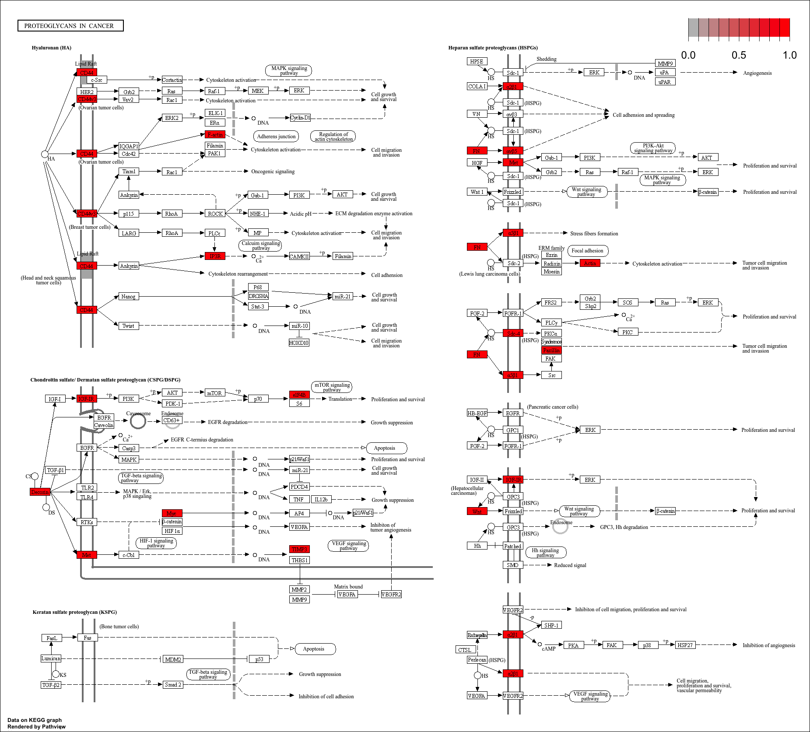
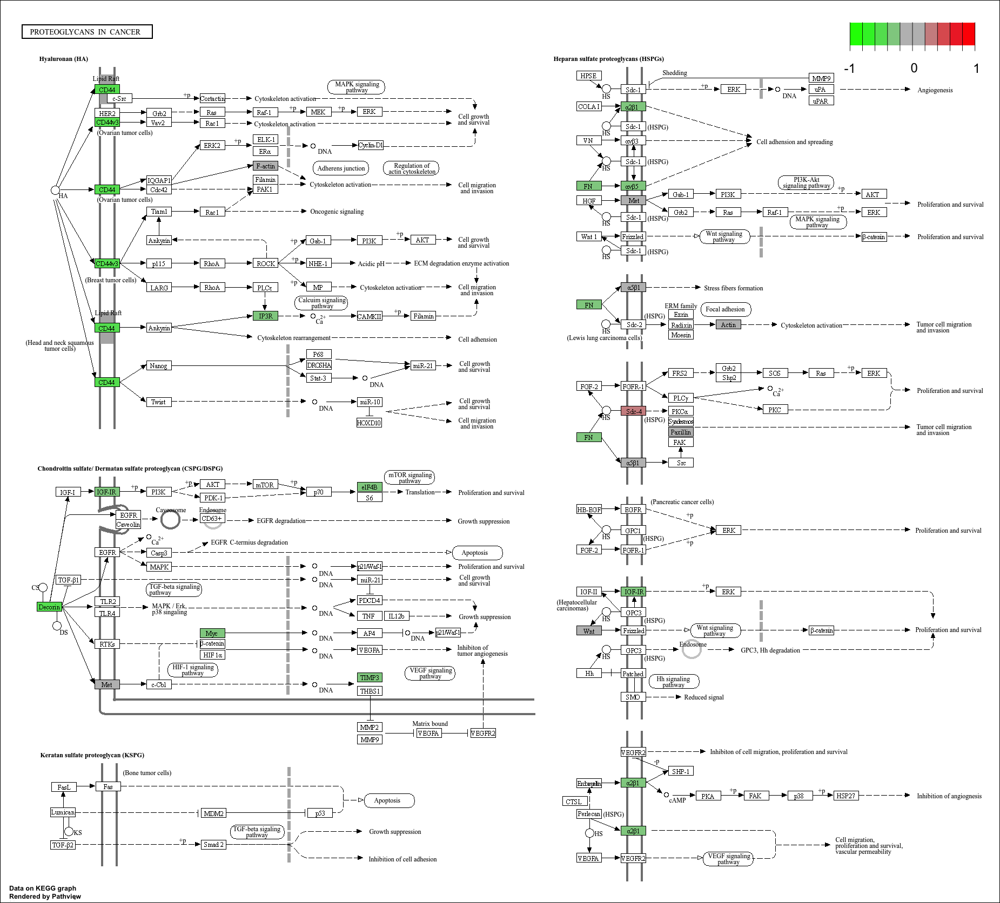
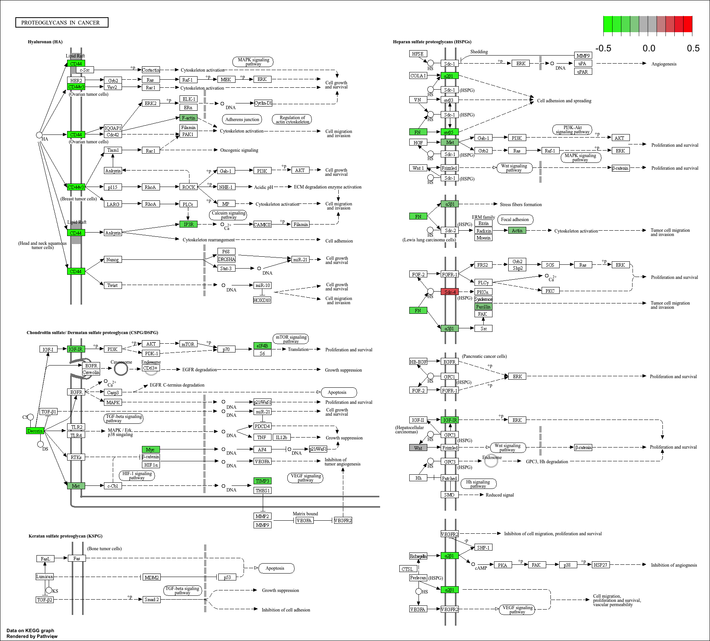
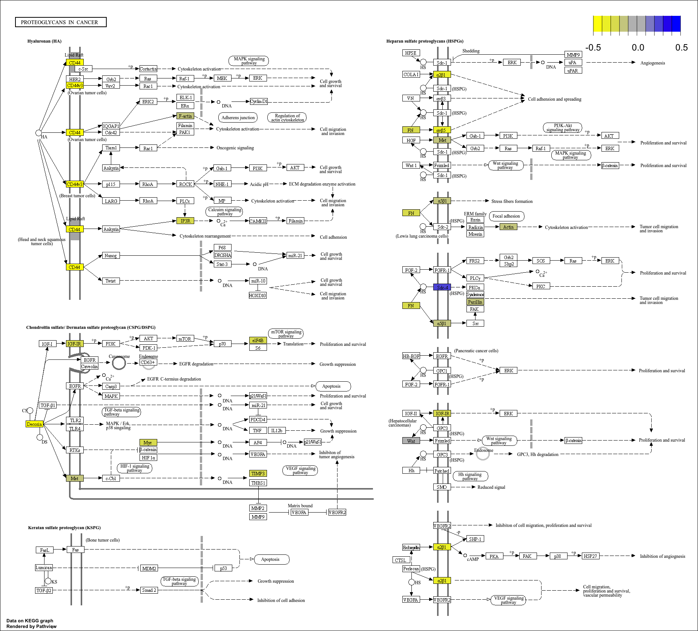

# Module 4: Pseudo-alignment and enrichment analysis

## Lecture

<iframe src="https://docs.google.com/presentation/d/1A6x8O0ae_uh1w9_zeNX3pyom4OJqcTR8/preview" width="640" height="480" allow="autoplay"></iframe>  

## Lab


In this tutorial you will perform functional enrichment analysis using:

1. Over-Representation Analysis (ORA) with gProfiler and clusterProfiler
2. Gene Set Enrichment analysis (GSEA) with fgsea and MSigDB


**4.1 What is enrichment analysis?**

Enrichment analysis tests whether specific pathways or biological functions are overrepresented in our DEG list.

Examples:

- immune response
- metabolism
- cell cycle
- apoptosis


**4.2 Required packages**

```{r setup, message=FALSE, warning=FALSE}
library(data.table)
library(ggplot2)
library(gprofiler2)
library(clusterProfiler)
library(org.Hs.eg.db)
library(enrichplot)
library(dplyr)
library(pathview)
library(KEGGREST)
library(fgsea)
library(msigdbr)
```


```{r , message=FALSE, warning=FALSE,echo=FALSE}
library(DESeq2)
url <- "https://www.ncbi.nlm.nih.gov/geo/download/?type=rnaseq_counts&acc=GSE114360&format=file&file=GSE114360_raw_counts_GRCh38.p13_NCBI.tsv.gz"

raw_counts <- fread(url)

# convert the data.table to matrix format
raw_counts = as.matrix(raw_counts)
class(raw_counts)

# set the gene ID values to be the row names for the matrix
rownames(raw_counts) = raw_counts[, "GeneID"]

# now that the gene IDs are the row names, remove the redundant column that contains them
raw_counts = raw_counts[, colnames(raw_counts) != "GeneID"]

# convert the count values from strings (with spaces) to integers, because originally the gene column contained characters, the entire matrix was set to character
class(raw_counts) = "integer"

# view the first few lines of the gene count matrix
#head(raw_counts)

# create a simple one column dataframe to start
metaData <- data.frame("Condition" = c("UHR", "UHR", "UHR", "HBR", "HBR", "HBR"))

# convert the "Condition" column to a factor data type
# the arbitrary order of these factors will determine the direction of log2 fold-changes for the genes (i.e. up or down regulated)
metaData$Condition = factor(metaData$Condition, levels = c("HBR", "UHR"))

# set the row names of the metaData dataframe to be the names of our sample replicates from the read counts matrix
rownames(metaData) = colnames(raw_counts)

# view the metadata dataframe
#head(metaData)

# check that names of htseq count columns match the names of the meta data rows
# use the "all" function which tests whether an entire logical vector is TRUE
all(rownames(metaData) == colnames(raw_counts))

dds = DESeqDataSetFromMatrix(countData = raw_counts, colData = metaData, design = ~Condition)

# run the DESeq2 analysis on the "dds" object
dds = DESeq(dds)

# view the first 5 lines of the DE results
res = results(dds)

#define DEGs
deg=subset(res,res$padj<0.01)

```


**4.3 Over-Representation Analysis (ORA)**

**4.3a Enrichment analysis with gProfiler**

Documentation : [gProfiler](https://biit.cs.ut.ee/gprofiler/gost)

gProfiler is a popular web tool and R package used to identify biological pathways, Gene Ontology terms, and molecular functions enriched in a list of genes.  

It compares our differentially expressed genes (DEGs) against known biological annotations from databases such as GO, KEGG, Reactome, and WikiPathways to help interpret the biological meaning of RNA-seq results.


```{r , message=FALSE, warning=FALSE}

gost.res = gost(

  # List of differentially expressed genes
  rownames(deg),

  # Organism used for the enrichment analysis
  # hsapiens = Homo sapiens (human)
  organism = "hsapiens",

  # Return only statistically significant enriched terms
  significant = TRUE,

  # Do not test for underrepresented pathways
  # FALSE means we only look for overrepresented terms
  measure_underrepresentation = FALSE,

  # Significance threshold for enrichment analysis
  user_threshold = 0.05,

  # Multiple testing correction method
  # FDR = False Discovery Rate correction
  correction_method = "fdr",

  # Include evidence codes for GO annotations
  evcodes = TRUE
)

```


```{r , message=FALSE, warning=FALSE}

# Extract Results
gostres = gost.res$result
head(gostres)

```


**Filter Enrichment Results**

We remove:

- very small terms (term_size)
- extremely large terms (term_size)
- weakly represented terms (intersection_size)


```{r , message=FALSE, warning=FALSE}
# filter results to reduce to less specialized or general terms with at least 2 genes from our list
gostres_filt = gostres[gostres$term_size > 15 & gostres$term_size < 2000 & gostres$intersection_size > 2,]

#trasnform score with log10, higher is better
gostres_filt$log10=-1 * log10(gostres_filt$p_value)

#order results by decreasing score value
gostres_filt=gostres_filt[order(gostres_filt$log10,decreasing=F),]
```


**Manhattan plot for all the results**

```{r , message=FALSE, warning=FALSE}

#Manhattan plot for all results
gostplot(gost.res)

```


**Interpretation**

Each point represents:

- one biological term/pathway

Higher points indicate:

- stronger enrichment
- lower adjusted p-values

Colors correspond to different databases:

- GO
- KEGG
- Reactome
- WikiPathways


**Barplot results for each database**

```{r , message=FALSE, warning=FALSE}


# barplots for top 10 KEGG pathways
res_table = gostres_filt[gostres_filt$source=="KEGG",][1:10, ]
 
#modify margins for long terms name
par(mar = c(5, 20, 4, 2))

barplot(
  res_table$log10,
  horiz = TRUE,
  names.arg = res_table$term_name,
  col = "steelblue",
  xlab = "-log10(padj)",
  xlim = c(0, ceiling(max(res_table$log10))),
  main = "Top 10 enriched terms",
  las = 1,      # horizontal labels
  cex.names = 0.8  # text size
)

```


**4.3b Enrichment analysis with clusterProfiler**

clusterProfiler is a widely used Bioconductor package for statistical analysis and visualization of functional profiles from genomic data.  

It allows users to perform enrichment analysis using Gene Ontology (GO), KEGG, Reactome, and Gene Set Enrichment Analysis (GSEA), while providing powerful visualization tools such as dotplots, enrichment maps, and pathway networks.


- GO Biological Process Enrichment

```{r, message=FALSE, warning=FALSE}
ego_bp = enrichGO(
  
  # List of differentially expressed genes
  gene          = rownames(deg),
  
  # Annotation database for human genes
  OrgDb         = org.Hs.eg.db,
  
  
  # Type of gene identifiers used in the gene list
  keyType       = "ENTREZID",

  ont           = "BP",
  
  #Method used to adjust p-values for multiple testing
  #BH = Benjamini-Hochberg False Discovery Rate correction
  pAdjustMethod = "BH",
  
  # Maximum raw p-value threshold
  pvalueCutoff  = 0.05,
  
  # Maximum adjusted p-value threshold (FDR/q-value)
  qvalueCutoff  = 0.05,
  
  
  # Convert gene IDs into readable gene symbols
  readable      = TRUE
)

head(as.data.frame(ego_bp))
```


**Question**

What does "BP" stand for?

Try changing:

```r
ont = "CC"
```

or

```r
ont = "MF"
```

What changes?


**- Visualize GO Results**

**GO Barplot**
```{r fig.width=10, fig.height=6, message=FALSE, warning=FALSE}
barplot(  ego_bp,  showCategory = 15)
```

**GO Dotplot**
```{r fig.width=10, fig.height=8, message=FALSE, warning=FALSE}
dotplot(  ego_bp,  showCategory = 20)
```


**Interpretation of Dotplots**

Dot size represents:

- number of genes

Dot color represents:

- statistical significance


**- KEGG Pathway Enrichment**

```{r, message=FALSE, warning=FALSE}
ekegg = enrichKEGG(
  gene = rownames(deg),
  organism = "hsa",
  pvalueCutoff = 0.05
)

head(as.data.frame(ekegg))
```


**Visualize KEGG Results**

- Barplot

```{r fig.width=10, fig.height=6, message=FALSE, warning=FALSE}
barplot(  ekegg,  showCategory = 15)
```

- Dotplot

```{r fig.width=10, fig.height=8, message=FALSE, warning=FALSE}
dotplot(  ekegg,  showCategory = 20)
```

Change the code to include only the top10 KEGG pathways.


details>
<summary>Show solution</summary>

```{r fig.width=10, fig.height=8, message=FALSE, warning=FALSE}
dotplot(  ekegg,  showCategory = 10)
```

</details>

- Pathview

The `pathview` package allows us to visualize gene expression changes directly on KEGG pathway diagrams.  

Genes are colored according to their expression levels or fold changes, making it easier to identify activated or repressed biological pathways and interpret RNA-seq results in a biological context.


```{r fig.width=10, fig.height=8, message=FALSE, warning=FALSE}

library(pathview)

# Create named vector of log2 fold changes
gene_list <- deg$log2FoldChange

# Names must be Entrez IDs
names(gene_list) <- rownames(deg)

# Visualize pathway
pathview(
  gene.data = names(gene_list),
  pathway.id = "hsa05205",
  species = "hsa",
  out.suffix = "init"
)


```

What is the difference with this code?

```{r fig.width=10, fig.height=8, message=FALSE, warning=FALSE}

# Visualize pathway
pathview(
  gene.data = gene_list,
  pathway.id = "hsa05205",
  species = "hsa",
  out.suffix = "logFC"

)


```

To customize the map, we need to identify the range of expression of the DEGs involved in this pathway:

```{r fig.width=10, fig.height=8, message=FALSE, warning=FALSE}

library(KEGGREST)

# Download KEGG pathway information
pathway_info = keggGet("hsa05205")

# Extract Entrez gene IDs
pathway_genes = pathway_info[[1]]$GENE

# Keep only Entrez IDs
pathway_entrez = pathway_genes[seq(1, length(pathway_genes), 2)]

head(pathway_entrez)

pathway_fc = gene_list[names(gene_list) %in% pathway_entrez]

summary(pathway_fc)


```


Redraw the map with an appropriate logFC range:


<details>
<summary>Show solution</summary>


```{r fig.width=10, fig.height=8, message=FALSE, warning=FALSE}

# Visualize pathway
pathview(
  gene.data = gene_list,
  pathway.id = "hsa05205",
  species = "hsa",
  out.suffix = "logFCx",
  limit = list(gene = 0.5) #logFC from -0.5 to 0.5
)


```

</details>

Know the scale color is correct, but from green to red. We usually avoid using these colors in figures.
Change the scale to: yellow - blue


<details>
<summary>Show solution</summary>

```{r fig.width=10, fig.height=8, message=FALSE, warning=FALSE}

# Visualize pathway
pathview(
  gene.data = gene_list,
  pathway.id = "hsa05205",
  species = "hsa",
  limit = list(gene = 0.5), #logFC from -0.5 to 0.5
  out.suffix = "logFCx_YB",

  # Low values (downregulated genes)
  low = list(gene = "yellow"),

  # High values (upregulated genes)
  high = list(gene = "blue")

)


```
</details>


**4.4 Gene Set Enrichment Analysis (GSEA)**

Unlike classical enrichment analysis that uses only significant DEGs,
GSEA uses ALL genes ranked by a statistic such as:

- log2FoldChange
- adjusted p-value

This approach avoids arbitrary DEG thresholds and can detect subtle but coordinated biological changes.


**4.4a Prepare Ranked Gene List**

We will rank genes using both:

- adjusted p-value (`padj`)
- direction of change (`log2FoldChange`)

Genes with:
- strong fold-changes
- low adjusted p-values

will obtain the highest scores.

```{r, message=FALSE, warning=FALSE}
# Remove genes with missing adjusted p-values
res_gsea = as.data.frame(res)

res_gsea = res_gsea[!is.na(res_gsea$padj),]
```


**Create Ranking Score**

We combine:

- statistical significance
- fold-change direction

using:

```r
-log10(padj) * sign(log2FoldChange)
```

```{r, message=FALSE, warning=FALSE}
gene_rank = -log10(res_gsea$padj) * sign(res_gsea$log2FoldChange)

# Add gene names
names(gene_rank) = rownames(res_gsea)

# Sort decreasingly
gene_rank = sort(gene_rank,decreasing = TRUE)

head(gene_rank)
```


**Visualize Ranking Distribution**

```{r fig.width=8, fig.height=5, message=FALSE, warning=FALSE}
hist(
  gene_rank,
  breaks = 100,
  col = "steelblue",
  main = "Distribution of GSEA Ranking Scores",
  xlab = "Ranking score"
)
```


**4.4b Run GSEA with Gene Sets from MSigDB**


[MSigDB](https://www.gsea-msigdb.org/gsea/msigdb) (Molecular Signatures Database) is a curated collection of annotated gene sets commonly used for pathway and enrichment analysis.  

It contains multiple categories of biological signatures, including Hallmark pathways, Gene Ontology terms, immune signatures, and curated pathways from databases such as KEGG and Reactome.

We will use the Hallmark gene sets.

Hallmark pathways summarize major biological processes such as:

- inflammation
- hypoxia
- apoptosis
- MYC signaling

```{r, message=FALSE, warning=FALSE}
hallmark_df = msigdbr(
  species = "Homo sapiens",
  collection = "H"
)

head(hallmark_df)
```


**Create Pathway List**

fgsea requires a list format:

- pathway name
- vector of genes

```{r, message=FALSE, warning=FALSE}
hallmark_list = hallmark_df %>%
  split(x = .$ncbi_gene,
        f = .$gs_name)

head(hallmark_list)
```

**Run fgsea**

```{r,  message=FALSE, warning=FALSE}
fgsea_res = fgsea(

  # Pathway list
  pathways = hallmark_list,

  # Ranked gene list
  stats = gene_rank,

  # Minimum pathway size
  minSize = 15,

  # Maximum pathway size
  maxSize = 500,

  # Number of permutations
  nperm = 1000
)
```


**4.4c Explore Results**

```{r}
head(fgsea_res)
```


**Sort Results**

```{r}
fgsea_res <- fgsea_res %>%arrange(padj)
head(fgsea_res)
```


**Question**

What does the NES (Normalized Enrichment Score) represent?


**Interpretation**

- Positive NES:
  pathway enriched among upregulated genes

- Negative NES:
  pathway enriched among downregulated genes

- Large absolute NES:
  stronger enrichment signal


**4.4d Visualize Top Pathways**

```{r fig.width=10, fig.height=8, message=FALSE, warning=FALSE}
topPathwaysUp <- fgsea_res %>%
  filter(NES > 0) %>%
  arrange(desc(NES)) %>%
  head(10)

ggplot(
  topPathwaysUp,
  aes(x = reorder(pathway, NES),
      y = NES)
) +
  geom_col(fill = "steelblue") +
  coord_flip() +
  theme_bw() +
  xlab("Pathway") +
  ylab("Normalized Enrichment Score") +
  ggtitle("Top Positively Enriched Pathways")
```


**Visualize Downregulated Pathways**

```{r fig.width=10, fig.height=8, message=FALSE, warning=FALSE}
topPathwaysDown <- fgsea_res %>%
  filter(NES < 0) %>%
  arrange(NES) %>%
  head(10)

ggplot(
  topPathwaysDown,
  aes(x = reorder(pathway, NES),
      y = NES)
) +
  geom_col(fill = "tomato") +
  coord_flip() +
  theme_bw() +
  xlab("Pathway") +
  ylab("Normalized Enrichment Score") +
  ggtitle("Top Negatively Enriched Pathways")
```


**Enrichment Plot for One Pathway**

```{r fig.width=10, fig.height=6, message=FALSE, warning=FALSE}
plotEnrichment(
  hallmark_list[["HALLMARK_INTERFERON_GAMMA_RESPONSE"]],
  gene_rank
) +
  labs(
    title = "GSEA Enrichment Plot: Apoptosis"
  )
```


**Interpretation of Enrichment Plot**

The curve shows where pathway genes appear
in the ranked gene list.

- Genes concentrated at the top:
  pathway activated

- Genes concentrated at the bottom:
  pathway repressed


**Visualize Multiple Pathways**

```{r fig.width=12, fig.height=10, message=FALSE, warning=FALSE}
top_pathways <- fgsea_res$pathway[1:5]

plotGseaTable(
  pathways = hallmark_list[top_pathways],
  stats = gene_rank,
  fgseaRes = fgsea_res,
  gseaParam = 1
)
```


**Volcano-style NES Plot**

```{r fig.width=10, fig.height=8, message=FALSE, warning=FALSE}
ggplot(
  fgsea_res,
  aes(x = NES,
      y = -log10(padj))
) +
  geom_point(aes(color = padj < 0.05),
             size = 3) +
  theme_bw() +
  scale_color_manual(
    values = c("grey70", "red")
  ) +
  xlab("Normalized Enrichment Score") +
  ylab("-log10 adjusted p-value") +
  ggtitle("fgsea Pathway Enrichment")
```


**Biological Interpretation Questions**

1. Which pathways are activated?
2. Which pathways are repressed?
3. Are immune pathways enriched?
4. Are proliferation pathways activated?
5. Which biological processes dominate the dataset?


**4.4e Mini Challenge**

Try modifying one parameter in the analysis:

Examples:

- change DEG threshold

Questions:

1. How many enriched pathways do you obtain?
2. Which pathways disappear?
3. Which pathways become more significant?


